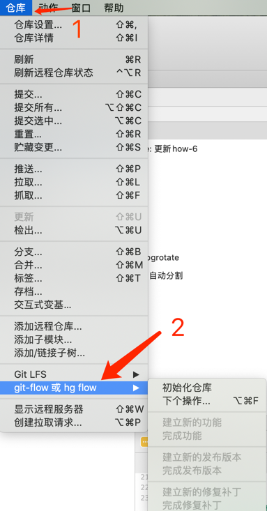

# "十万个"怎么做：如何玩转 `Gitflow`

## 是什么

在介绍 `Gitflow` 之前，我先介绍下 `git` 的诞生背景。long long ago（1991年），
有一个叫 Linus 的芬兰人开源了大名鼎鼎的 `Linux` 系统，既然是开源的，
所以呢就有很多人给 `Linux` 提代码，然后 Linus 在手动合并，
当时提交代码是通过 [diff](https://www.ruanyifeng.com/blog/2012/08/how_to_read_diff.html)
的方式啊，这个东西我试了下，如果文件数量少并且文件内容少还行，如果多了估计"王德发"了。

事实也是如此，随着 `Linux` 项目越来越大，社区的人也越来越多，社区里也对这种方式表达了强烈的不满。
于是 Linux 用了一个"免费版"的商业版本控制系统 `BitKepper` (现在开源了)。由于本质上它是一个付费的软件，
那 `Linux` 社区里这帮富有开源精神的人看不过去了，就破解人家的协议。那人家肯定生气啊，说了只要 Linus 公开"道歉"下就行。
然后呢，这个 Linus 也不是善茬，人家用了两周自己写了一个版本控制系统：`git`。（时间发生在2005年）

从那以后，`git` 发展迅速，很多个人或组织都在用，很快就成为了最流行的版本控制系统。由于团队规模和业务都不同，出现了很多种模型（使用 `git `的方式）,
比如： `Gitflow` 、`GitHub flow`、`GitLab flow`等。

总的来说，`Gitflow` 就是一种使用 `git` 的方式，规定如何命名分支、合并分支、打tag等操作。就像现在你的公司规定的 `git` 规则一样，
只不过 `Gitflow` 更出名一些。

那我们以上面这个背景下，想象一下 `Gitflow` 的作者（Vincent Driessen）是怎么想的呢？

其实按照当时的互联网背景，常用的功能还是以软件为载体的，web占比还很低（web应用通常是 [持续交付](https://baike.baidu.com/item/%E6%8C%81%E7%BB%AD%E4%BA%A4%E4%BB%98/9803571?fr=aladdin) ），当时的软件迭代周期相对稳定并且长，使用 `Gitflow`
可以解决多个特性同时进行开发的场景，并且可以保证不同特性的代码互不影响。

`Gitflow` 图例：


[图片来源](https://nvie.com/posts/a-successful-git-branching-model/)

## 为什么

* 对团队来讲，有利于多人协作，保证每个人在项目迭代的周期内做正确的事儿。对新人来讲，也能很快的熟悉工作流（相信大部分的程序员或多或少的听过或者用过）。
* 对项目来说，有利于查看项目发布以来的历史，查看各个阶段做了哪些功能迭代和 bug 修复。
* 对维护和或者开发者来说，有利于查看每个人某个特定时段做了哪些事，比如在 finish release 阶段时，可以 review 代码。也可以针对某个线上版本快速回滚。

## 怎么做

在我们开始时间 `Gitflow` 之前，我们先了解下该模型下的分支类型。

主要包括：

### 主分支

* master
* develop

master 分支是一个原始的主分支。develop 分支是与 master 分支并行的分支。develop 最开始是从 master 分出来的。

master 一般就是线上（也可以说生产）环境对应的分支。所以每次要上线一个版本时，就要把**包含最终代码的分支**（注意这里，这里意味着该分支上已经没有影响线上的 bug 了，并且相关配置：版本号、BaseUrl 都是正确的了）合并到 master 分支。
**一般只允许 hotfix 和 release 分支合并到 master**。

develop 是和 master 并行的分支，但是一般是优先于 master 的。基本上其他分支都是从 develop checkout（以下用"检出"代替） 来的。

### 支持分支

* Feature branches
* Release branches
* Hotfix branches

这些分支都有特殊的含义。接下来会详细说明：

#### Feature branches

1、一般会从 develop 检出；

2、结束后必须合并到 develop；

3、分支命名不能和主分支和其他支持分支冲突；

该分支一般是在开始一个新的需求时，从 develop 检出相应的分支。当开发结束并测试通过后合并到 develop 分支，并作为之后的 release 的上流分支。

#### Release branches

1、需要从 develop 检出；

2、结束后必须合并到 develop 和 master；

3、命名规则一般：release-*；

该分支是在 Feature branches 分支结束后，准备上线前的阶段时，从 develop 检出分支。
并在该分支进行突发问题的修复和修改相关配置（版本号、环境变量等）。注意的是，禁止在该分支添加大功能，
因为这属于新特性，按理要放到下一个特性分支中进行。

> release 分支的主要流程就是：开发 -> 测试 -> 修改bug -> 重新部署到测试环境 -> 再次测试。
> 这个流程一直重复，直到测试没问题，并且产品和运营等验收通。

#### Hotfix branches

1、一般是从 master 检出；

2、结束后必须合并到 develop 和 master；

3、命名规则一般：hotfix-*；

该分支一般是在线上出问题时用到，且分支基本上是必须从 master 检出的。原因是 develop 分支可能包含了新版本的代码，如果从 develop 检出的话，
最后导致线上分支 master 包含不该出现的功能或 bug。

> 这里需要注意下，只有线上紧急的 bug 才会从 master 检出，否则会放到下次版本迭代中（放到 feature 中）。

### 实操环节

这里我们举两个比较常见的场景：

#### 同时只有一个需求进行

背景：

1、该项目是一个商城；

2、目前线上版本为 1.0.0；

3、现在新增一个收藏商品的功能；

##### 第一步：创建 feature branch，命名为：feat-goodsCollect

手动方式：
```shell
# 从 develop 检出分支：feat-goodsCollect
git checkout -b feat-goodsCollect develop
```

git-flow 方式（由于 git-flow 会自动根据支持分支特性创建对应的父级目录，所以不需要添加前缀（比如 feat-* 、release-* ）：
```shell
# 初始化（只在项目初始化是，执行一次就好）
git flow init
# 从 develop 检出分支：-goodsCollect
git flow feature start goodsCollect
```

##### 第二步：跟测阶段，修改 bug

```shell
# 修改了xxx bug
...
git commit -m '修改了xxx bug'
...
```

##### 第三步：当测试人员测试完毕，准备切换线上环境验收时（并且版本号等配置已修改）

手动方式：
```shell
# 切换到 develop 分支
git checkout develop
# 合并 feat-goodsCollect 到 develop
git merge --no-ff feat-goodsCollect
# 删除特性分支 feat-goodsCollect
git branch -d feat-goodsCollect
# 推到到远端
git push origin develop

# 检出 release 分支
git checkout -b release-1.1.0
```

git-flow 方式：
```shell
# 完成 feature 分支
git flow feature finish goodsCollect
# 开始 release 阶段
git flow release start 1.1.0
```


##### 第四步：测试和产品运营人员线上验收，验收通过，准备上线

手动方式：
```shell
# 切换到 master
git checkout master
# 合并 release-1.1.0 到 maser (一般建议合并后，再自测下或者让测试再点点，预防出现问题)
git merge --no-ff release-1.1.0
# 打 tag
git tag -a 1.1.0
```

git-flow 方式：
```shell
git flow release finish 1.1.0
```

##### 第五步：上线完毕，同步代码，删除分支

手动方式：
```shell
# 把相关修改同步到 develop
git checkout develo
git merge --no-ff release-1.1.0
# 删除 release 分支
git checkout -d release-1.1.0
```

git-flow 方式：此时就不用手动执行了，在执行第四步的 git-flow 后就已经帮我们完成了清理操作。

#### 同时有多个需求进行

背景：

1、该项目还是一个商城；

2、目前线上版本为 1.0.0；

3、现在新增一个收藏商品的功能和一个收藏店铺功能；

4、但是这两个需求由于某种原因不能同时上线，但是需要同步开发。"收藏商品"先上线，"收藏店铺"第二天上线；

##### 第一步：创建 feature branches：feat-goodsCollect、feat-storeCollect

```shell
# 从 develop 检出分支：feat-goodsCollect
git checkout -b feat-goodsCollect develop
# 从 develop 检出分支：feat-storeCollect
git checkout -b feat-storeCollect develop
```

##### 第二步：跟测阶段，修改 bug

> 这时就会有问题了，假如只有两个测试人员，并且每个需求的测试周期都是一天，所以领导说了，我们这两个需求要在一天内完成。
> 但是由于是同一个项目，测试环境一般只有一套。那怎么办？
>
> 1、要不就先测"收藏商品"，等没问题后再测"收藏店铺"（根据以上描述，这个方案肯定不行）
>
> 2、要不就同时测这两个功能
>
> 第一种情况好说，我们的 feature 分支可以不同，但是实力不允许啊。所以我们以第二种为例说明


```shell
# 切到 feat-goodsCollect
git checkout feat-goodsCollect
# 合并 feat-storeCollect 到 feat-goodsCollect
git merge --no-ff feat-storeCollect

# 修改了xxx bug
...
git commit -m '修改了xxx bug'
...
```

##### 第三步：当测试人员测试完毕，准备切换线上环境验收时（并且版本号等配置已修改）

> 注意：
> 这里的操作其实就有点"骚了"，我们在合并分支前，需要将项目中有关"店铺收藏"的入口手动隐藏

```shell
# 隐藏本次不上线的功能
git commit -m '隐藏"店铺收藏"的入口'

# 切换到 develop 分支
git checkout develop
# 合并 feat-goodsCollect 到 develop
git merge --no-ff feat-goodsCollect
# 删除特性分支 feat-goodsCollect
git branch -d feat-goodsCollect
# 推到到远端
git push origin develop

# 检出 release 分支
git checkout -b release-1.1.0
```

##### 第四步：测试和产品运营人员线上验收，验收通过，准备上线

```shell
# 切换到 master
git checkout master
# 合并 release-1.1.0 到 maser (一般建议合并后，再自测下或者让测试再点点，预防出现问题)
git merge --no-ff release-1.1.0
# 打 tag
git tag -a 1.1.0
```

##### 第五步：上线完毕，同步代码，删除分支

```shell
# 把相关修改同步到 develop
git checkout develo
git merge --no-ff release-1.1.0
# 删除 release 分支
git checkout -d release-1.1.0
```

##### 第六步：由于第二天就要上线"店铺收藏"，所以还需要检出对应的 release-1.2.0 分支。

> 此时 develop 分支其实包含了已经修复完 bug 的代码了，所以也就不需要再把 feat-storeCollect 合到 develop 了

```shell
# 切换到 develop 分支
git checkout develop
# 删除特性分支 feat-storeCollect
git branch -d feat-storeCollect
# 推到到远端
git push origin develop

# 检出 release 分支
git checkout -b release-1.2.0
```

##### 第七步：这里就和之前的上线步骤一样了。

```shell
# 切换到 master
git checkout master
# 合并 release-1.1.0 到 maser (一般建议合并后，再自测下或者让测试再点点，预防出现问题)
git merge --no-ff release-1.2.0
# 打 tag
git tag -a 1.2.0
```

```shell
# 把相关修改同步到 develop
git checkout develo
git merge --no-ff release-1.2.0
# 删除 release 分支
git checkout -d release-1.2.0
```

### 使用工具

> 以上步骤都是手动执行分支的 checkout 和 merge，为了解决繁琐的步骤，我们可以使用工具或图形化完成。

#### git 扩展工具 git-flow
 [git-flow](https://www.git-tower.com/learn/git/ebook/cn/command-line/advanced-topics/git-flow/)
，从 [同时只有一个需求进行](#同时只有一个需求进行) 里 git-flow 和手动的对比可以看出，git-flow 可以减轻我们的工作量，让我们可以更方便的使用 `Gitflow`。
 可以从这篇文章 [gitflow-workflow](https://www.atlassian.com/git/tutorials/comparing-workflows/gitflow-workflow) 查看工作原理。

#### sourcetree



#### vscode 插件

[GitFlow 4 Code](https://marketplace.visualstudio.com/items?itemName=GreatMinds.gitflow4code)

## 总结

首先承认 `Gitflow` 确实是个好模型，也为其他 git 模型做了基础。但毕竟它的诞生时间是在 2010 年提出的，
在这 11 年间，web应用的兴起，互联网的初创企业越来越多，"持续交付"的模式成为主流，在某些场景下 `Gitflow`
确实用起来很繁琐。就如同 [同时有多个需求进行](#同时有多个需求进行) 里的两个需求在很短的时间内依次上线（其实这种情况下，其他模型也未必有好的方案）。

那有没有一个好的 git 模型适应所有场景，反正到目前为止是没有的。但其实我们可以参考 `Gitflow` 来指定一个属于自己团队的模型。

其实 `Gitflow` 在某些具体的场景也是很模糊，比如是提测时检出 release 分支，还是在 feature 分支上提测，并测试通过后再检出 release 分支。
如果按照 `Gitflow` 的思想的话，应该是提测时检出 release 分支，但这样可能会导致 develop 分支上包含很大 bug 的代码，如果这时从 develop 检出的
feature 分支就会有问题（我们建议是在 feature 分支提测并测试，测试通过后再检出 release 分支）。


还有一点是：上线时，是发布 master 还是 release 分支，在接入 CI/CD 的情况下，一般都是在 master 有 merge 或者打 tag 时触发。那我们肯定是以
master 为上线分支了。如果没有 CI/CD 也建议用 master 做为上线分支，因为有可能在上线前，release 分支检查后，有个 hotfix 被合到了 develop 和
master ，所以这时用 master 上线比较保险（其实也不是绝对，有可能那个 hotfix 导致了此次上线的有问题。所以 release 合到 master 后，再次回归测试下。）。

参考文章：
* https://blog.csdn.net/weixin_43117449/article/details/84573917
* https://nvie.com/posts/a-successful-git-branching-model/
* https://datasift.github.io/gitflow/IntroducingGitFlow.html
* https://www.pianshen.com/article/71331461353/
* https://www.infoq.cn/article/i7m3UdTFLu1Lv2ai6abv
