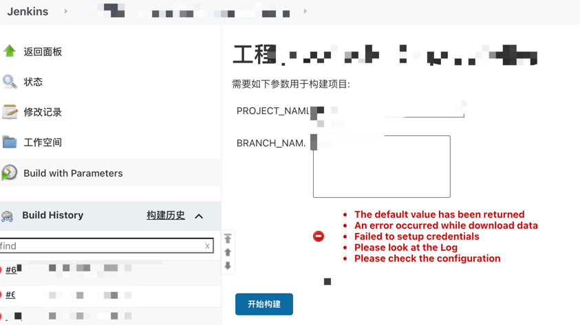
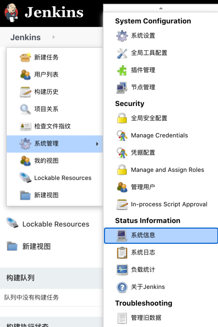

# "十万个"怎么做：如何解决 Jenkins 提示 `... "ENOSPC: no space left on device..` 问题

## 背景

某天同事说 Jenkins 没法部署了，在项目的视图中提示如下：

（图1）

## 查找原因

发现一头雾水，然后通过查询失败的构建历史中的日志中发现了如下关键词：`... "ENOSPC: no space left on device..` （大概意思就是服务器上的空间不足了）。

很明显，我们登录到服务器查看磁盘空间（`df -h`）发现磁盘使用率 100%，当我们释放一部分空间后（如 图3 所示点击 `清空工作空间` ），再次部署发现成功。

（图2） （👆是优化后的空间，一开始红色区域的已用是 100%）

（图3）

### 分析

那么为啥会出现磁盘空间不足的情况呢：除了其他用户在相同的磁盘内存储文件外，Jenkins 每次部署也会产生文件。

由于我们主要用来部署前端项目，在打包前都会安装依赖，但是部署成功后又没有及时删除 `node_modules`，随着项目的增多，占用的空间也越来越大。

## 怎么做

### 第一种：临时方案

- 进入每个 Jenkins 的视图，然后手动清空 `工作空间`，如图3所示。

### 第二种：一劳永逸

> 注意一定要做好备份，要不失败了可就麻烦了。
> 
> 注意一定要做好备份，要不失败了可就麻烦了。
> 
> 注意一定要做好备份，要不失败了可就麻烦了。

1、将 Jenkins 的 `jenkins_home` 目录迁移到空间更大的磁盘内（Jenkins 存储的所有数据都在 `jenkins_home` 这个目录下）。

2、每次部署成功后都将 `node_modules` 及时删除。

#### 实操环节

- *第 1 步*：做好备份
  - 1.1 找到 Jenkins 的主要空间目录：Jenkins > 系统管理 > 系统信息 > JENKINS_HOME
    - 
    - 
  - 1.2 手动备份 JENKINS_HOME 对应的目录
    - `cp -r /var/libjenkins 备份的路径`
  - 1.3 通过插件 [Thin Backup Plugin](https://plugins.jenkins.io/thinBackup/#releases) ，来备份全局配置和工作目录配置。

- *第 2 步*：停止 Jenkins 服务
  - `systemctl stop jenkins`

- *第 3 步*：更改 `JENKINS_HOME` 环境变量的值
  - 3.1 `vim /etc/sysconfig/jenkins`
  - 3.2 找到 `JENKINS_HOME` 并修改值为你要迁移的目录
  - 3.3 保存并退出

- *第 4 步*：重启 Jenkins 服务
  - `systemctl start jenkins`

## 总结

1、以上操作环境是在 `centos 7.9` 中进行的。

2、Jenkins 的安装方式是通过 `yum` 安装的。

3、Jenkins 服务是通过 `systemctl` 启动的。并没有用 `docker` 、 `Tomcat`，如果是以上两种方式那么操作方式是不通的哦。

4、如果在重启 Jenkins 时提示 `Starting Jenkins bash: /usr/bin/java: No such file or directory`，可以手动添加 `jdk` (通过命令 `which java` 可获取) 的路径到文件 `/etc/init.d/jenkins` 中。

参考链接：

* [Jenkins 配置 jdk](https://blog.csdn.net/a772304419/article/details/100916667)
