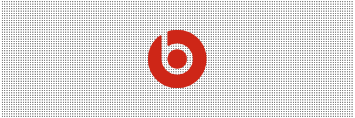

# "十万个"怎么做：如何用 CSS 实现一个网

## 是什么

我们要实现如下图所示的一个「网状」背景：

[](../examples/net.html)

## 怎么做

### 原理

创建一个最小「网状」单元的 css 图像。然后在容器内重复这个图像即可。

- 第一步：创建一个网状的最小单元（比如 4x4 的一个 css 图像）
  - 我们利用 [radial-gradient](https://developer.mozilla.org/zh-CN/docs/Web/CSS/gradient/radial-gradient()) 来实现一个 css 图像。
    ```css
    background-image: radial-gradient(gray 1px, white 1px);
    background-size: 4px 4px;
    ```

    [](../examples/net.html)

- 第二步：重复这个 4x4 的图像即可
   ```css
    /* 当然这个步骤可以忽略，默认情况下就是 repeat */
    background-repeat: repeat;
   ```

## 总结

其实原来很简单，难的是想到用 [radial-gradient](https://developer.mozilla.org/zh-CN/docs/Web/CSS/gradient/radial-gradient()) 来实现一个最小网状单元。

一般在项目开发中，我们很少用到 `radial-gradient` 这个 css 函数，即使用到了也是实现类型平滑渐变的场景，像实现这种'实线'（相邻颜色没有渐变效果）场景很少，即使遇到了也是 UI 切图实现的。

### 灵感来源

* [motion](https://motion.dev/dom/timeline) 的导航栏。


### 参考

* [创建实线](https://developer.mozilla.org/en-US/docs/Web/CSS/CSS_Images/Using_CSS_gradients#creating_hard_lines)
