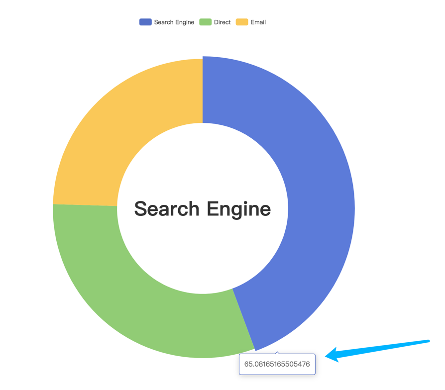

# "十万个"怎么做：如何实现动态设置 echarts tooltip 的内容

## 是什么

[tooltip](https://echarts.apache.org/zh/option.html#tooltip) 是 `echarts` 的提示框组件。如图一所示：



图一

## 为什么

为什么要实现 "动态设置 echarts tooltip 的内容" ，试想如下场景：假如鼠标悬浮到 图一 中的黄色扇区时，显示 Email 的种类和使用人群占比，
那这部分数据是通过另一个接口获取的，然后手动设置，所以就遇到了我们今天的主题了。

## 怎么做

### 主要思路

- 第一步：想办法阻止默认悬浮或者点击时出现 tooltip 的行为。
- 第二步：如何才能手动给每个数据项设置单独的 tooltip 内容。
- 第三步：获取到异步数据后如何手动显示和隐藏 tooltip 。

### 具体实现

- 第一步：我们可以设置 [tooltip.triggerOn](https://echarts.apache.org/zh/option.html#tooltip.triggerOn) 为 `none` 来组织 tooltip 的展示。
  ```javascript
    option = {
      legend: {
        top: '5%',
        left: 'center'
      },
      tooltip: {
        trigger: 'item',
        triggerOn: 'none'
      },
      series: []
    };
  ```

- 第二步：可以在 `series.data` 中给每个数据项设置 `tooltip` ，其内容可以通过字符串模板 [formatter](https://echarts.apache.org/zh/option.html#tooltip.formatter) 来设置内容。之后获取到异步数据后，修改 `formatter` 的值就好了。
  ```javascript
    option = {
      ...省略
      series: [
        {
          ...省略
          data: [
            {
              value: 1048,
              name: 'Search Engine',
              tooltip: {}
            },
            {
              value: 735,
              name: 'Direct',
              tooltip: {}
            },
            {
              value: 580,
              name: 'Email',
              tooltip: {}
            }
          ]
        }
      ]
    };
  ``` 
  > 提示：`series.data.tooltip` 和 全局的 `tooltip` 一定要同时设置，要不会不展示的。

- 第三步：获取到异步数据后，在展示或隐藏 `tooltip` ，这里我们主要用到 [action.tooltip.showTip](https://echarts.apache.org/zh/api.html#action.tooltip.showTip) 来实现。
   ```javascript
     function showTooltip(dataIndex, seriesIndex) {
      myChart.dispatchAction({
        type: 'showTip',
        seriesIndex: seriesIndex,
        dataIndex: dataIndex
      });
    }
  
    function hideTooltip(dataIndex) {
      myChart.dispatchAction({ type: 'hideTip' });
    }

    myChart.on('mouseover', res => {
      getAsynsData().then(data => {
        res.data.tooltip.formatter = data
        showTooltip(res.dataIndex, res.seriesIndex)
      })
    })
  ```

到此我们就实现了今天的主题啦！🐶

## 总结

本实践是在 `echarts@5.2.2` 基础上开发的。

[具体实现](#具体实现) 中的代码只是一部分，具体可参考 [demo](../examples/pie-doughnut.html)。

### 参考

- [事件与行为](https://echarts.apache.org/handbook/zh/concepts/event)

- [echartsInstance.on](https://echarts.apache.org/zh/api.html#echartsInstance.on)

- [echartsInstance.dispatchAction](https://echarts.apache.org/zh/api.html#echartsInstance.dispatchAction)
